# SUSEP Insurance Data Warehouse


A historical end-to-end ETL and dimensional modeling project built from public Brazilian insurance data using SQL Server 2022, SQL Server Integration Services (SSIS), Visual Studio 2022, and SQL Power Architect.

> **Project status:** completed educational project. The implementation was developed between 2023 and 2024, and the committed data snapshot covers the December 2023 reference period. The repository preserves the original SQL Server and SSIS architecture instead of presenting it as a modern production platform.

## What this project demonstrates

- interpretation of public datasets and their supporting documentation;
- definition of business scope and fact-table grain;
- dimensional modeling with natural and surrogate keys;
- implementation of a star schema in SQL Server;
- dimension and fact-table ETL workflows in SSIS;
- integration of seven regulatory CSV sources;
- treatment of duplicate source records and missing dimension references;
- derivation of analytical attributes from source measures;
- load sequencing, source-to-target mapping, and traceability;
- export of warehouse tables for downstream analysis.

The value of this project is in the transferable data engineering foundations: understanding the source, defining the model, documenting transformation rules, and building a repeatable load process.

## Business and data context

The Brazilian Private Insurance Superintendence — **SUSEP** — publishes data reported by insurance companies and other supervised organizations through periodic regulatory forms.

The source files contain information about companies, insurance lines, premiums, claims, technical provisions, reinsurance, and retention limits. They are distributed across multiple CSV files and use regulatory codes that are not immediately suitable for analytical consumption.

This project organizes a subset of those datasets into a dimensional model focused on:

- public-sector surety insurance — line `0775`;
- private-sector surety insurance — line `0776`;
- rental guarantee insurance — line `0746`.

The original source files and table documentation are available from the [SUSEP statistical data portal](https://www2.susep.gov.br/menuestatistica/ses/principal.aspx).

SUSEP can revise previously published historical data. That behavior influenced the decision to rebuild the fact table during each execution of this historical implementation.

## Architecture

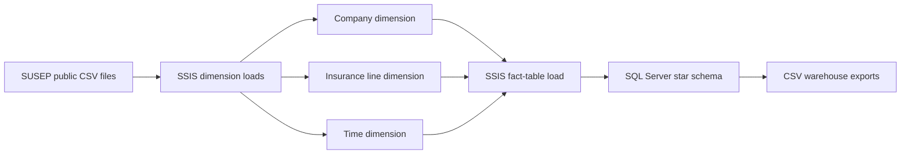

The pipeline follows four main stages:

1. collect and inspect the SUSEP source files and documentation;
2. define and create the dimensional model in SQL Server;
3. load the dimensions before processing the fact table;
4. export the resulting warehouse tables as CSV files.

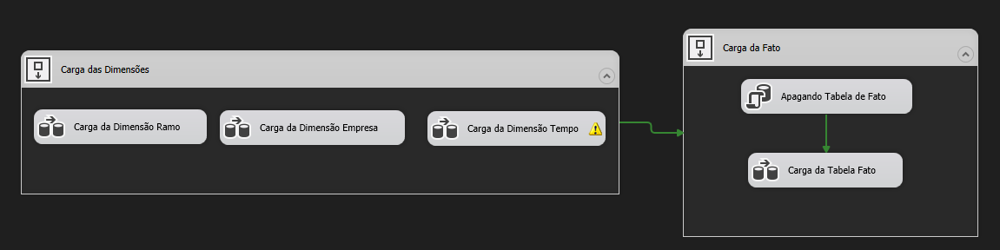

## Technology stack

| Technology | Role |
|---|---|
| SQL Server 2022 | Data warehouse storage and relational constraints |
| SQL Server Integration Services | Extraction, transformation, and load workflows |
| Visual Studio 2022 | SSIS project development environment |
| SQL Power Architect | Dimensional model design and DDL generation |
| T-SQL | Schema creation, unknown members, and classification analysis |
| Git LFS | Versioning of the larger source CSV files |

## Data sources

Seven SUSEP CSV files are used by the project.

| Source file | Primary use |
|---|---|
| `Ses_grupos_economicos.csv` | Company names, codes, and economic-group hierarchy |
| `Ses_pl_margem.csv` | Adjusted equity used in the company dimension |
| `Ses_limite_ret.csv` | Retention limits for surety and rental guarantee insurance |
| `Ses_ramos.csv` | Insurance-line codes and descriptions |
| `ses_gruposramos.csv` | Insurance-line group hierarchy |
| `Ses_seguros.csv` | Premiums, claims, reinsurance values, and time reference |
| `ses_provramos.csv` | Technical provisions by company, insurance line, and period |

The official SUSEP filenames and the original `data/arquivos_csv/` hierarchy are intentionally preserved because they are used as source contracts by the historical SSIS package. Supporting documentation is organized under `docs/susep-source-documentation/`.

## Dimensional model

The warehouse uses a star schema with three dimensions and one fact table.

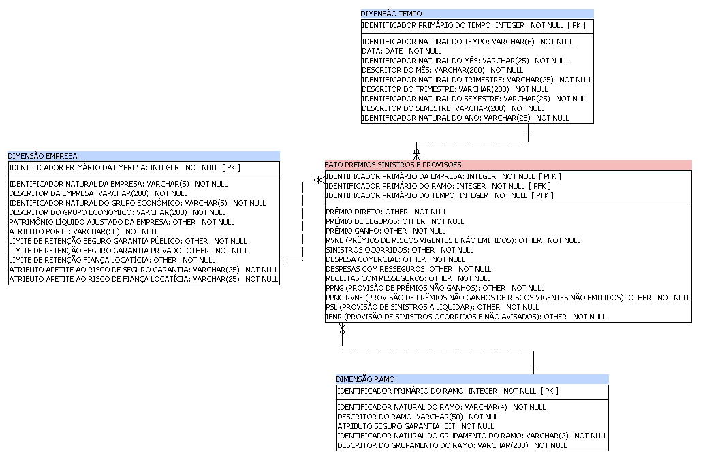

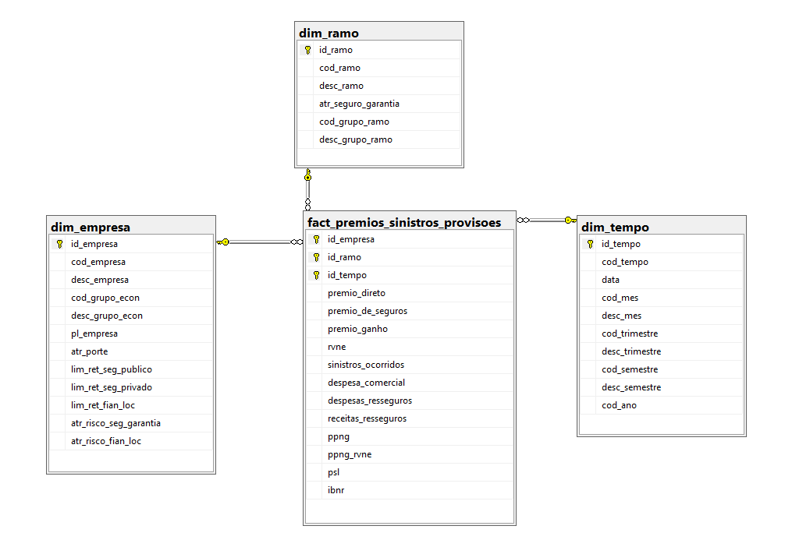

### Fact-table grain

The fact-table grain is:

> one row per company, insurance line, and reference month.

The composite primary key consists of `id_empresa`, `id_ramo`, and `id_tempo`. Each field is also a foreign key to its corresponding dimension.

### Company dimension — `dim_empresa`

The company dimension contains:

- company natural code and description;
- economic-group code and description;
- adjusted equity;
- public- and private-sector surety retention limits;
- rental guarantee retention limit;
- company-size classification;
- surety risk-appetite classification;
- rental guarantee risk-appetite classification.

The integer surrogate key `id_empresa` is generated through SQL Server identity behavior.

### Insurance-line dimension — `dim_ramo`

This dimension contains the insurance-line natural code and description, its group code and description, and a Boolean attribute identifying surety insurance lines. It uses the surrogate key `id_ramo`.

### Time dimension — `dim_tempo`

The time dimension is derived from the `YYYYMM` source reference and contains the full reference, date, month, quarter, semester, and year.

```text
Month → Quarter → Semester → Year
```

### Fact table — `fact_premios_sinistros_provisoes`

The fact table stores:

- direct, insurance, and earned premiums;
- RVNE — premiums related to risks in force but not yet issued;
- incurred claims;
- commercial expenses;
- reinsurance expenses and revenue;
- PPNG and PPNG RVNE;
- PSL — outstanding claims provision;
- IBNR — incurred but not reported claims provision.

The original analytical design also defines downstream metrics that are not materialized as columns by the DDL script:

```text
Loss ratio = Incurred claims / Earned premium
Profit = Earned premium - Incurred claims
Return (%) = Profit / Earned premium × 100
Reinsurance result = Reinsurance revenue - Reinsurance expenses
```

## ETL design

### Load sequence

The three dimensions are processed before the fact table. The fact table is then cleared and rebuilt from the source files.

This full-load approach was chosen because SUSEP can revise historical measures in later source releases. It keeps the educational implementation straightforward and prevents duplicate accumulation.

### Company dimension load

The company dimension combines company hierarchy, adjusted equity, and retention-limit data.

The workflow:

1. reads company and economic-group information;
2. converts the reference-period field;
3. retains the most recent source record for each company;
4. joins adjusted-equity information;
5. converts source zero values to null where appropriate;
6. trims whitespace from descriptions;
7. reads retention limits for lines `0775`, `0776`, and `0746`;
8. derives company-size and risk-appetite classifications;
9. compares source records with the existing dimension;
10. updates existing members and inserts new members.

<details>
<summary>Company dimension flow</summary>

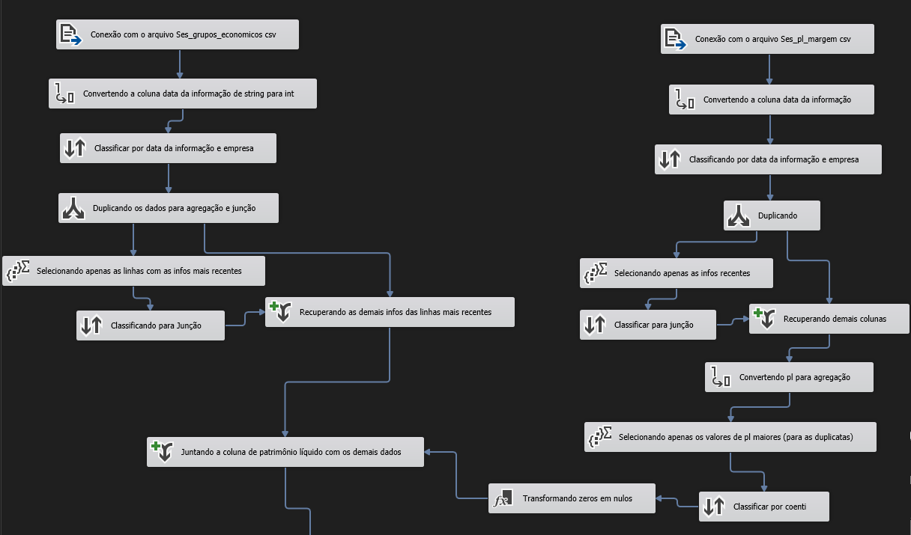

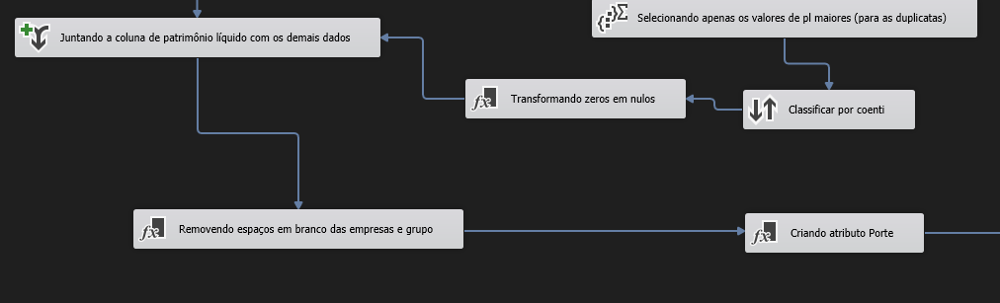

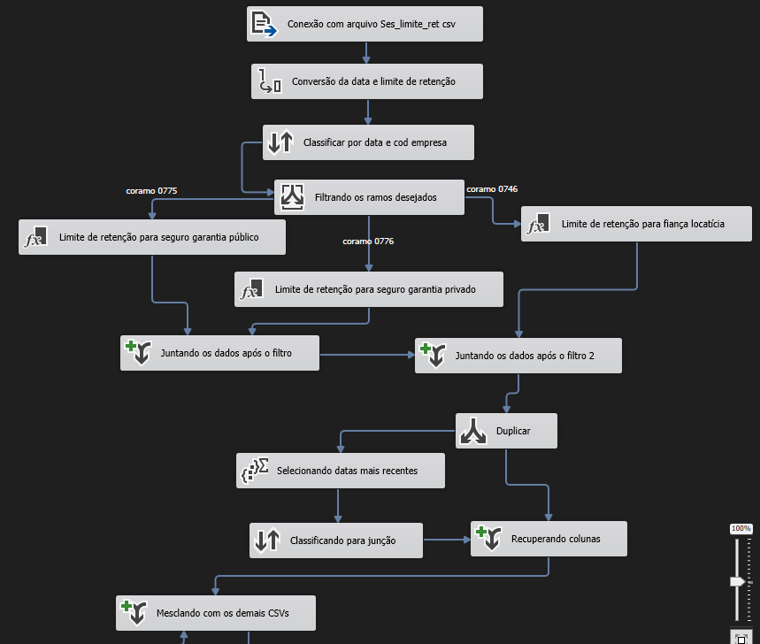

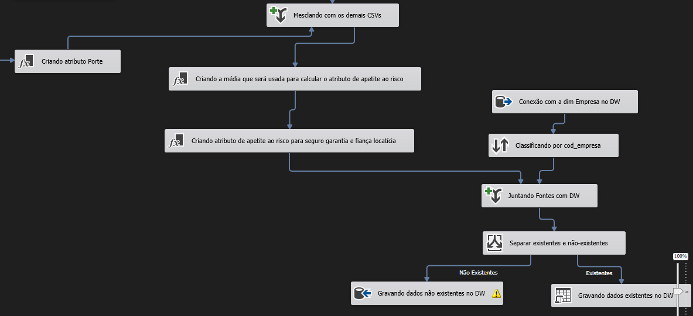

</details>

#### Company-size classification

The historical project applies `NTILE(4)` to adjusted-equity values. The labels remain in Portuguese inside the SSIS package because they are part of the original implementation.

| Adjusted equity | Stored label | English meaning |
|---:|---|---|
| Up to 17,423,287.20 | `Iniciante` | Emerging |
| Up to 90,166,348.36 | `Intermediário` | Intermediate |
| Up to 309,270,786.50 | `Consolidado` | Established |
| Above 309,270,786.50 | `Líder` | Leader |

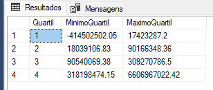

These thresholds were derived from the committed snapshot and are not regulatory or permanent market classifications.

#### Risk-appetite classifications

The surety classification uses the average of public- and private-sector retention limits while accounting for null values.

| Average surety retention limit | Stored label |
|---:|---|
| Up to 188,790.00 | `Pequeno` |
| Up to 2,000,000.00 | `Médio` |
| Above 2,000,000.00 | `Grande` |

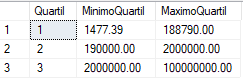

The rental guarantee classification uses these ranges:

| Rental guarantee retention limit | Stored label |
|---:|---|
| Up to 80,000.00 | `Pequeno` |
| Up to 1,000,000.00 | `Médio` |
| Above 1,000,000.00 | `Grande` |

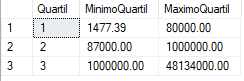

Both classifications use three data-driven groups, so the related SQL files are described as *tertiles*, not quartiles.

### Insurance-line dimension load

The workflow reads the insurance-line and group files, derives the group code, joins each line to its group, trims source codes, identifies surety lines `0775` and `0776`, and then updates or inserts dimension members.

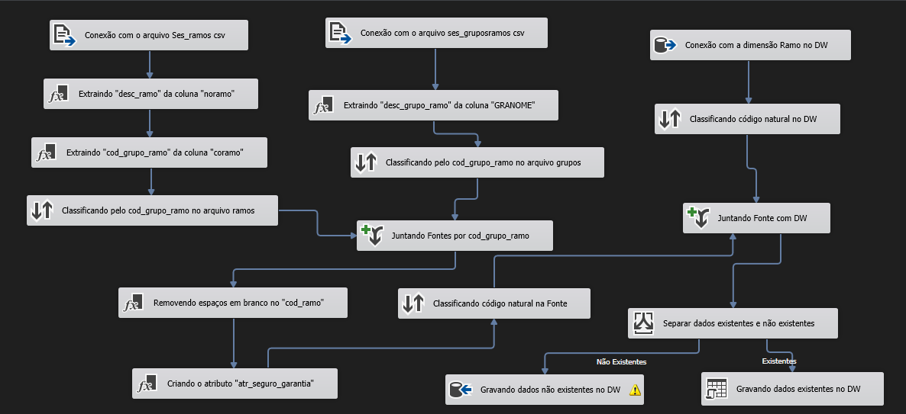

### Time dimension load

The time workflow obtains distinct `YYYYMM` references from `Ses_seguros.csv`, creates a date representation, derives month, quarter, semester, and year attributes, and then updates or inserts dimension members.

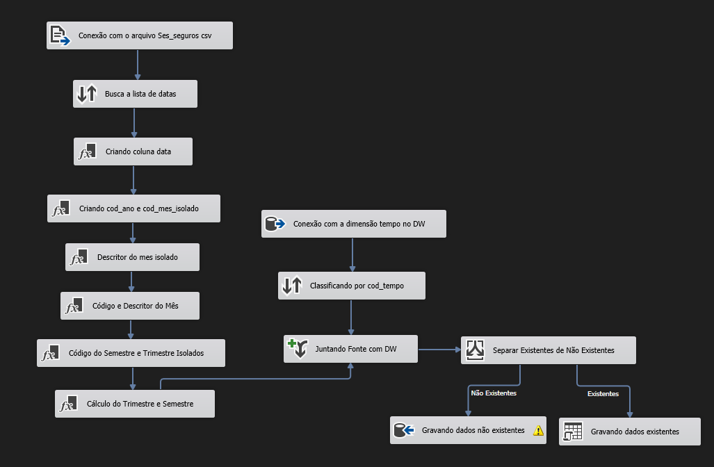

### Fact-table load

The fact workflow combines `Ses_seguros.csv` with `ses_provramos.csv`.

The pipeline:

1. filters both sources to the insurance lines in scope;
2. converts measures and reference fields to target data types;
3. keeps reference periods from 2018 onward;
4. sorts both streams by period, company, and insurance line;
5. joins premiums, claims, and reinsurance data to technical provisions;
6. aggregates source rows with the same natural dimensional identifiers;
7. looks up company, insurance-line, and time surrogate keys;
8. assigns surrogate key `0` when no dimension member is found;
9. writes the result to the fact table.

<details open>
<summary>Fact-table flow</summary>

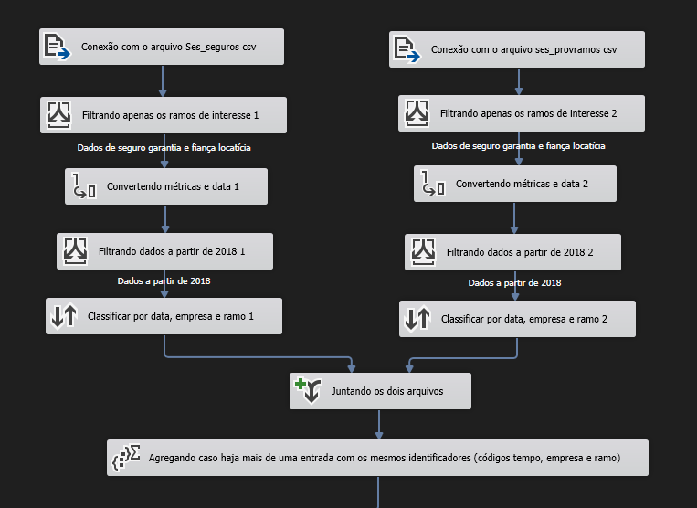

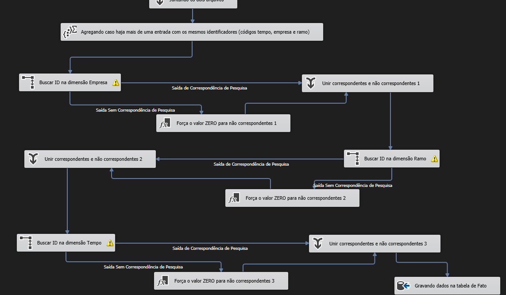

</details>

## Unknown dimension members

Before the ETL package runs, `sql/seed/insert-unknown-dimension-members.sql` creates a member with surrogate key `0` in every dimension.

This provides a valid foreign-key destination when a source record cannot be matched to a previously loaded member. The historical package redirects unmatched lookups to this member instead of rejecting them or writing them to a quarantine table.

## Committed data snapshot

The repository contains a December 2023 source snapshot stored through Git LFS.

### Source files

| Source | Rows |
|---|---:|
| Company and economic groups | 59,095 |
| Retention limits | 649,195 |
| Adjusted equity and margins | 51,856 |
| Insurance-line groups | 22 |
| Insurance lines | 154 |
| Technical provisions | 912,807 |
| Insurance measures | 1,641,521 |
| **Total source rows** | **3,314,650** |

### Warehouse exports

| Exported table | Rows |
|---|---:|
| Company dimension | 420 |
| Insurance-line dimension | 155 |
| Time dimension | 349 |
| Premiums, claims, and provisions fact | 12,048 |

These counts describe the files committed to the repository. They are not current SUSEP market totals.

## Repository structure

```text
.
├── data/
│   ├── arquivos_csv/                 # Original source hierarchy used by SSIS
│   └── warehouse-exports/            # Exported dimensions and fact table
├── docs/
│   ├── images/                       # Architecture and ETL evidence
│   └── susep-source-documentation/   # Original source documentation
├── modeling/
│   └── power-architect/              # Dimensional model
├── sql/
│   ├── analysis/                     # Snapshot classification queries
│   ├── ddl/                          # Warehouse schema
│   └── seed/                         # Unknown dimension members
├── ssis/
│   ├── expressions/                  # Derived-attribute expressions
│   └── project/                      # Original Visual Studio / SSIS project
├── .gitattributes
├── .gitignore
├── LICENSE
└── README.md
```

The external folder structure is now in English. Official source filenames, SSIS component names, and stored category labels remain unchanged to preserve the historical implementation and avoid unvalidated changes to the package internals.

## Running the historical implementation

### Prerequisites

- Git LFS;
- SQL Server 2022;
- Visual Studio 2022;
- SQL Server Integration Services Projects extension;
- SQL Power Architect, only when editing the dimensional model.

### Setup

1. Clone the repository and download the Git LFS objects:

   ```bash
   git lfs install
   git lfs pull
   ```

2. Create an empty SQL Server database.

3. Run:

   ```text
   sql/ddl/create-data-warehouse.sql
   sql/seed/insert-unknown-dimension-members.sql
   ```

4. Open `ssis/project/DataWarehouseSUSEP/DataWarehouseSUSEP.sln` in Visual Studio.

5. Update the flat-file connection managers to point to the local source files under `data/arquivos_csv/`.

6. Update the OLE DB connection manager to point to the local SQL Server database.

7. Execute `CargaDataWarehouse.dtsx`.

8. If required, export the warehouse tables to `data/warehouse-exports/`.

## Refreshing the data

To process a newer SUSEP release:

1. download the corresponding CSV files from the official portal;
2. preserve the official source filenames;
3. replace the files under `data/arquivos_csv/`;
4. verify that the source schema has not changed;
5. execute the SSIS package;
6. validate dimension and fact-table row counts.

Because SUSEP can change source layouts and reload historical data, a newer release should not be treated as a guaranteed drop-in replacement without schema validation.

## Design decisions and limitations

- The SSIS package contains machine-specific absolute file paths and requires local connection updates.
- Connection managers are not parameterized.
- The fact table is rebuilt rather than loaded incrementally.
- Dimension updates use row-level OLE DB commands, which may not scale efficiently.
- Unmatched dimension references receive member `0` rather than being quarantined.
- Classification thresholds depend on the committed data distribution.
- The schema uses SQL Server `MONEY` fields because that was the original design decision.
- Source data, internal SSIS component names, and stored category labels remain in Portuguese.
- Generated Visual Studio artifacts are preserved in history and ignored for future changes.
- The repository does not include automated tests, CI, or production orchestration.

These limitations are documented rather than hidden. The project demonstrates the foundational decisions required to turn multiple regulatory sources into a traceable dimensional warehouse.

## License

This project is licensed under the [Creative Commons Attribution-NonCommercial 4.0 International License](https://creativecommons.org/licenses/by-nc/4.0/).

## Acknowledgements and disclaimer

The project uses public data and documentation provided by SUSEP for educational and non-commercial purposes. It is an independent project and is not affiliated with, endorsed by, or maintained by SUSEP.

The committed data is a historical snapshot and must not be interpreted as current regulatory or market information. Any reuse should be validated against the latest official publications.

## Author

Developed by [Renan Vettori](https://www.linkedin.com/in/renanvettori/).
