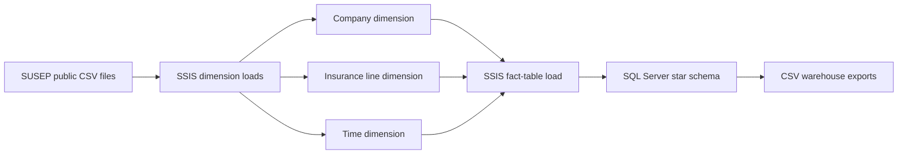

# SUSEP Insurance Data Warehouse


This is a historical ETL and dimensional modeling project built from public Brazilian insurance data. It uses SQL Server 2022, SQL Server Integration Services (SSIS), Visual Studio 2022, and SQL Power Architect.

> **Status:** This is a completed educational project. I developed it between 2023 and 2024, and the committed data snapshot covers December 2023. The repository keeps the original SQL Server and SSIS architecture; it is not presented as a modern production platform.

## What I built

- interpretation of public datasets and their supporting documentation;
- definition of business scope and fact-table grain;
- dimensional modeling with natural and surrogate keys;
- implementation of a star schema in SQL Server;
- dimension and fact-table ETL workflows in SSIS;
- integration of seven regulatory CSV sources;
- treatment of duplicate source records and missing dimension references;
- derivation of analytical attributes from source measures;
- load sequencing, source-to-target mapping, and traceability;
- export of warehouse tables for downstream analysis.

The useful part of this project is the data engineering work behind the tables: understanding the source, defining the model, documenting transformations, and building a load process that can be run again.

## Business and data context

The Brazilian Private Insurance Superintendence, known as **SUSEP**, publishes data reported by insurance companies and other supervised organizations through periodic regulatory forms.

The source files contain information about companies, insurance lines, premiums, claims, technical provisions, reinsurance, and retention limits. They are distributed across multiple CSV files and use regulatory codes that are not immediately suitable for analytical consumption.

I organized a subset of those datasets into a dimensional model focused on:

- public-sector surety insurance — line `0775`;
- private-sector surety insurance — line `0776`;
- rental guarantee insurance — line `0746`.

The original source files and table documentation are available from the [SUSEP statistical data portal](https://www2.susep.gov.br/menuestatistica/ses/principal.aspx).

SUSEP may revise historical data after it has been published. For that reason, this implementation rebuilds the fact table on each run.

## Architecture



The work is organized into four stages:

1. collect and inspect the SUSEP source files and documentation;
2. define and create the dimensional model in SQL Server;
3. load the dimensions before processing the fact table;
4. export the resulting warehouse tables as CSV files.


## Tools used

| Technology | Role |
|---|---|
| SQL Server 2022 | Data warehouse storage and relational constraints |
| SQL Server Integration Services | Extraction, transformation, and load workflows |
| Visual Studio 2022 | SSIS project development environment |
| SQL Power Architect | Dimensional model design and DDL generation |
| T-SQL | Schema creation, unknown members, and classification analysis |
| Git LFS | Versioning of the larger source CSV files |

## Source data

The warehouse uses seven SUSEP CSV files.

| Source file | Primary use |
|---|---|
| `Ses_grupos_economicos.csv` | Company names, codes, and economic-group hierarchy |
| `Ses_pl_margem.csv` | Adjusted equity used in the company dimension |
| `Ses_limite_ret.csv` | Retention limits for surety and rental guarantee insurance |
| `Ses_ramos.csv` | Insurance-line codes and descriptions |
| `ses_gruposramos.csv` | Insurance-line group hierarchy |
| `Ses_seguros.csv` | Premiums, claims, reinsurance values, and time reference |
| `ses_provramos.csv` | Technical provisions by company, insurance line, and period |

I kept the official SUSEP filenames and the original `data/arquivos_csv/` hierarchy because the historical SSIS package expects them. Supporting documentation is under `docs/susep-source-documentation/`.

## Warehouse model

The model uses a star schema with three dimensions and one fact table.


### Fact-table grain

The fact table has one row per company, insurance line, and reference month.

The composite primary key consists of `id_empresa`, `id_ramo`, and `id_tempo`. Each field is also a foreign key to its corresponding dimension.

### Company dimension — `dim_empresa`

The company dimension stores:

- company natural code and description;
- economic-group code and description;
- adjusted equity;
- public- and private-sector surety retention limits;
- rental guarantee retention limit;
- company-size classification;
- surety risk-appetite classification;
- rental guarantee risk-appetite classification.

SQL Server generates the integer surrogate key `id_empresa`.

### Insurance-line dimension — `dim_ramo`

This dimension stores the insurance-line code and description, its group code and description, and a Boolean field for surety insurance. Its surrogate key is `id_ramo`.

### Time dimension — `dim_tempo`

The time dimension comes from the `YYYYMM` source reference. It stores the full reference, date, month, quarter, semester, and year.

```text
Month → Quarter → Semester → Year
```

### Fact table — `fact_premios_sinistros_provisoes`

The fact table stores:

- direct, insurance, and earned premiums;
- RVNE — premiums related to risks in force but not yet issued;
- incurred claims;
- commercial expenses;
- reinsurance expenses and revenue;
- PPNG and PPNG RVNE;
- PSL — outstanding claims provision;
- IBNR — incurred but not reported claims provision.

The original design also describes these metrics, although the DDL script does not materialize them as columns:

```text
Loss ratio = Incurred claims / Earned premium
Profit = Earned premium - Incurred claims
Return (%) = Profit / Earned premium × 100
Reinsurance result = Reinsurance revenue - Reinsurance expenses
```

## ETL

### Load sequence

The package loads the three dimensions first, then clears and rebuilds the fact table from the source files.

I used a full load because later SUSEP releases can revise historical measures. It keeps this implementation easy to follow and avoids accumulating duplicate records.

### Company dimension load

The company dimension combines company hierarchy, adjusted equity, and retention-limit data.

For each load, the package:

1. reads company and economic-group information;
2. converts the reference-period field;
3. retains the most recent source record for each company;
4. joins adjusted-equity information;
5. converts source zero values to null where appropriate;
6. trims whitespace from descriptions;
7. reads retention limits for lines `0775`, `0776`, and `0746`;
8. derives company-size and risk-appetite classifications;
9. compares source records with the existing dimension;
10. updates existing members and inserts new members.

<details>
<summary>Company dimension flow</summary>


</details>

#### Company-size classification

The historical project applies `NTILE(4)` to adjusted-equity values. The labels remain in Portuguese inside the SSIS package because they are part of the original implementation.

| Adjusted equity | Stored label | English meaning |
|---:|---|---|
| Up to 17,423,287.20 | `Iniciante` | Emerging |
| Up to 90,166,348.36 | `Intermediário` | Intermediate |
| Up to 309,270,786.50 | `Consolidado` | Established |
| Above 309,270,786.50 | `Líder` | Leader |


These thresholds were derived from the committed snapshot and are not regulatory or permanent market classifications.

#### Risk-appetite classifications

The surety classification uses the average of public- and private-sector retention limits while accounting for null values.

| Average surety retention limit | Stored label |
|---:|---|
| Up to 188,790.00 | `Pequeno` |
| Up to 2,000,000.00 | `Médio` |
| Above 2,000,000.00 | `Grande` |


The rental guarantee classification uses these ranges:

| Rental guarantee retention limit | Stored label |
|---:|---|
| Up to 80,000.00 | `Pequeno` |
| Up to 1,000,000.00 | `Médio` |
| Above 1,000,000.00 | `Grande` |


Both classifications use three groups derived from the data. That is why the related SQL files use the term *tertiles*, not quartiles.

### Insurance-line dimension load

The package reads the insurance-line and group files, derives each group code, joins lines to their groups, trims source codes, identifies surety lines `0775` and `0776`, and updates or inserts dimension members.


### Time dimension load

The time load takes distinct `YYYYMM` references from `Ses_seguros.csv`, creates dates, derives month, quarter, semester, and year, and updates or inserts dimension members.


### Fact-table load

The fact workflow combines `Ses_seguros.csv` with `ses_provramos.csv`.

The package:

1. filters both sources to the insurance lines in scope;
2. converts measures and reference fields to target data types;
3. keeps reference periods from 2018 onward;
4. sorts both streams by period, company, and insurance line;
5. joins premiums, claims, and reinsurance data to technical provisions;
6. aggregates source rows with the same natural dimensional identifiers;
7. looks up company, insurance-line, and time surrogate keys;
8. assigns surrogate key `0` when no dimension member is found;
9. writes the result to the fact table.

<details open>
<summary>Fact-table flow</summary>


</details>

## Unknown dimension members

Before the ETL package runs, `sql/seed/insert-unknown-dimension-members.sql` creates a member with surrogate key `0` in every dimension.

This gives the fact table a valid foreign-key destination when a source record has no matching dimension member. The historical package sends unmatched lookups to this member instead of rejecting them or writing them to a quarantine table.

## Committed data snapshot

The committed snapshot covers December 2023 and is stored through Git LFS.

### Source files

| Source | Rows |
|---|---:|
| Company and economic groups | 59,095 |
| Retention limits | 649,195 |
| Adjusted equity and margins | 51,856 |
| Insurance-line groups | 22 |
| Insurance lines | 154 |
| Technical provisions | 912,807 |
| Insurance measures | 1,641,521 |
| **Total source rows** | **3,314,650** |

### Warehouse exports

| Exported table | Rows |
|---|---:|
| Company dimension | 420 |
| Insurance-line dimension | 155 |
| Time dimension | 349 |
| Premiums, claims, and provisions fact | 12,048 |

These row counts belong to the files committed here. They are not current SUSEP market totals.

## Repository structure

```text
.
├── data/
│   ├── arquivos_csv/                 # Original source hierarchy used by SSIS
│   └── warehouse-exports/            # Exported dimensions and fact table
├── docs/
│   ├── images/                       # Architecture and ETL evidence
│   └── susep-source-documentation/   # Original source documentation
├── modeling/
│   └── power-architect/              # Dimensional model
├── sql/
│   ├── analysis/                     # Snapshot classification queries
│   ├── ddl/                          # Warehouse schema
│   └── seed/                         # Unknown dimension members
├── ssis/
│   ├── expressions/                  # Derived-attribute expressions
│   └── project/                      # Original Visual Studio / SSIS project
├── .gitattributes
├── .gitignore
├── LICENSE
└── README.md
```

The top-level folder structure is in English. I left official source filenames, SSIS component names, and stored category labels unchanged to preserve the historical implementation and avoid untested changes inside the packages.

## Running the historical implementation

### Prerequisites

- Git LFS;
- SQL Server 2022;
- Visual Studio 2022;
- SQL Server Integration Services Projects extension;
- SQL Power Architect, only when editing the dimensional model.

### Setup

1. Clone the repository and download the Git LFS objects:

   ```bash
   git lfs install
   git lfs pull
   ```

2. Create an empty SQL Server database.

3. Run:

   ```text
   sql/ddl/create-data-warehouse.sql
   sql/seed/insert-unknown-dimension-members.sql
   ```

4. Open `ssis/project/DataWarehouseSUSEP/DataWarehouseSUSEP.sln` in Visual Studio.

5. Update the flat-file connection managers to point to the local source files under `data/arquivos_csv/`.

6. Update the OLE DB connection manager to point to the local SQL Server database.

7. Execute `CargaDataWarehouse.dtsx`.

8. If required, export the warehouse tables to `data/warehouse-exports/`.

## Refreshing the data

To process a newer SUSEP release:

1. download the corresponding CSV files from the official portal;
2. preserve the official source filenames;
3. replace the files under `data/arquivos_csv/`;
4. verify that the source schema has not changed;
5. execute the SSIS package;
6. validate dimension and fact-table row counts.

SUSEP can change source layouts and reload historical data. Validate the schema before treating a newer release as a drop-in replacement.

## Design decisions and limitations

- The SSIS package contains machine-specific absolute file paths and requires local connection updates.
- Connection managers are not parameterized.
- The fact table is rebuilt rather than loaded incrementally.
- Dimension updates use row-level OLE DB commands, which may not scale efficiently.
- Unmatched dimension references receive member `0` rather than being quarantined.
- Classification thresholds depend on the committed data distribution.
- The schema uses SQL Server `MONEY` fields because that was the original design decision.
- Source data, internal SSIS component names, and stored category labels remain in Portuguese.
- Generated Visual Studio artifacts are preserved in history and ignored for future changes.
- The repository does not include automated tests, CI, or production orchestration.

These limitations are part of the project. They also show the decisions involved in turning several regulatory sources into a dimensional warehouse that can be traced back to its inputs.

## License

This project is licensed under the [Creative Commons Attribution-NonCommercial 4.0 International License](https://creativecommons.org/licenses/by-nc/4.0/).

## Acknowledgements and disclaimer

This project uses public data and documentation from SUSEP for educational and non-commercial purposes. It is independent and is not affiliated with, endorsed by, or maintained by SUSEP.

The committed data is a historical snapshot, not current regulatory or market information. Check the latest official publications before reusing it.

## Author

Developed by [Renan Vettori](https://www.linkedin.com/in/renanvettori/).
